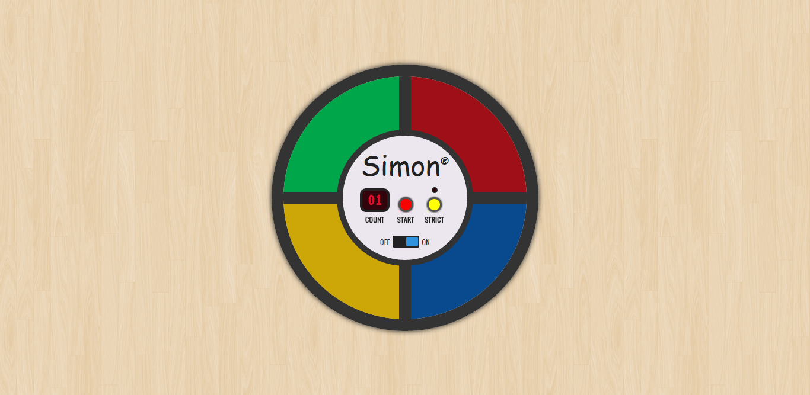

# Simon&reg;

Simon is an electronic game of memory skill invented by Ralph H. Baer and Howard J. Morrison, with software programming by Lenny Cope, The original version was manufactured and distributed by Milton Bradley but now the game is currently manufactured by Hasbro. 

## Play

Checkout the live version of the game [here](http://purush0th.github.io/simon-game/) :smile:

